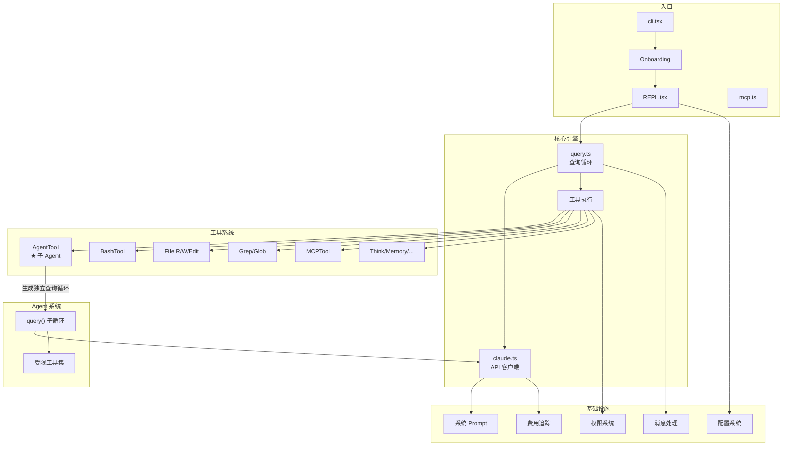

# Claude Code v0.2.8 - 源码学习指南

> 来源：从已删除的 npm 包 `@anthropic-ai/claude-code@0.2.8` 中提取（2025 年 2 月）。

## 组件导航

按推荐学习顺序排列：

| # | 组件 | 文档 | 核心文件 | 重要度 |
|---|------|------|----------|--------|
| 1 | [Agent 系统](./01-agent-system.md) | Agent 团队、子 Agent 生成、并发编排 | `tools/AgentTool/`, `query.ts` | ★★★★★ |
| 2 | [查询循环](./02-query-loop.md) | 核心查询引擎、流式响应、工具编排 | `query.ts`, `screens/REPL.tsx` | ★★★★★ |
| 3 | [工具系统](./03-tool-system.md) | 插件式工具接口、18 个内置工具 | `tools.ts`, `tools/*/` | ★★★★☆ |
| 4 | [权限系统](./04-permission-system.md) | 两级权限模型、安全控制 | `permissions.ts`, `components/permissions/` | ★★★★☆ |
| 5 | [MCP 系统](./05-mcp-system.md) | MCP 客户端/服务器双重角色 | `services/mcpClient.ts`, `entrypoints/mcp.ts` | ★★★★☆ |
| 6 | [消息处理](./06-message-processing.md) | 消息类型、标准化、渲染 | `utils/messages.tsx`, `components/Message.tsx` | ★★★☆☆ |
| 7 | [配置系统](./07-configuration.md) | 多层配置、项目上下文 | `utils/config.ts`, `context.ts` | ★★★☆☆ |
| 8 | [系统 Prompt](./08-system-prompts.md) | Prompt 工程、行为约束 | `constants/prompts.ts` | ★★★☆☆ |
| 9 | [CLI 与命令](./09-cli-commands.md) | 入口点、斜杠命令 | `entrypoints/cli.tsx`, `commands.ts` | ★★☆☆☆ |
| 10 | [UI 组件](./10-ui-components.md) | React/Ink 终端 UI | `components/`, `screens/` | ★★☆☆☆ |
| 11 | [服务层](./11-services.md) | API 客户端、费用追踪、错误上报 | `services/claude.ts`, `cost-tracker.ts` | ★★☆☆☆ |
| 12 | [非核心功能与彩蛋](./12-non-core-features.md) | 语音、贴纸彩蛋、VCR、主题、自动更新等 | 散布各处 | ★★★☆☆ |
| 13 | [记忆系统](./13-memory-system.md) | 隐藏的文件型持久化记忆、启用条件与限制 | `src/tools/MemoryReadTool/`, `src/tools/MemoryWriteTool/`, `src/utils/env.ts` | ★★☆☆☆ |

## 整体架构一览

## 技术栈速查

| 类别 | 技术 |
|------|------|
| 语言 | TypeScript (TSX) |
| 运行时 | Node.js 18+ |
| 终端 UI | React + Ink |
| CLI 解析 | Commander.js |
| 数据校验 | Zod |
| AI SDK | @anthropic-ai/sdk v0.36.3 |
| 协议 | Model Context Protocol (MCP) |
| 并发控制 | 异步生成器 + Promise.race |

## 统计数据

- 211 个源文件，~26,000 行代码
- 18 个内置工具，21 个斜杠命令
- 40+ UI 组件，16 个 React Hooks
- 构建产物：单文件 23.1 MB `cli.mjs`
