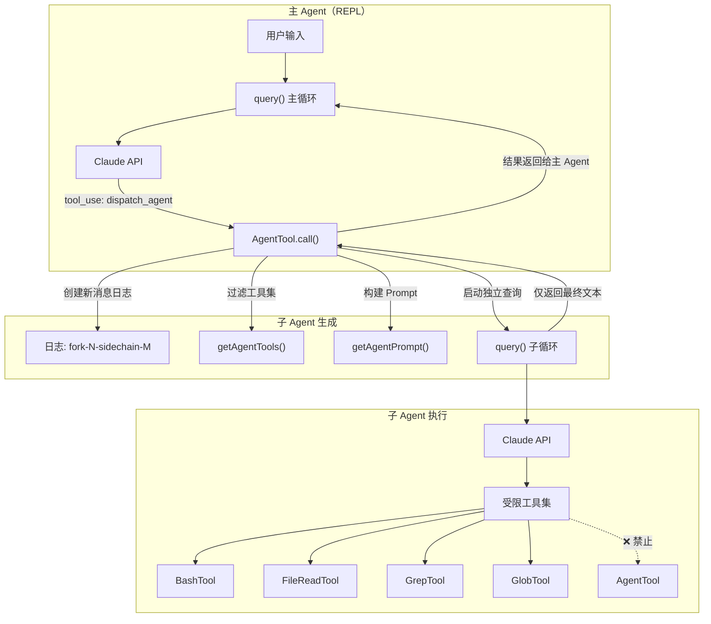
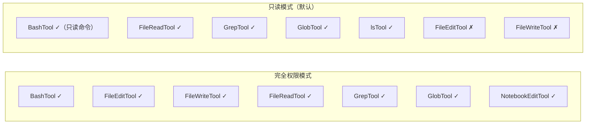
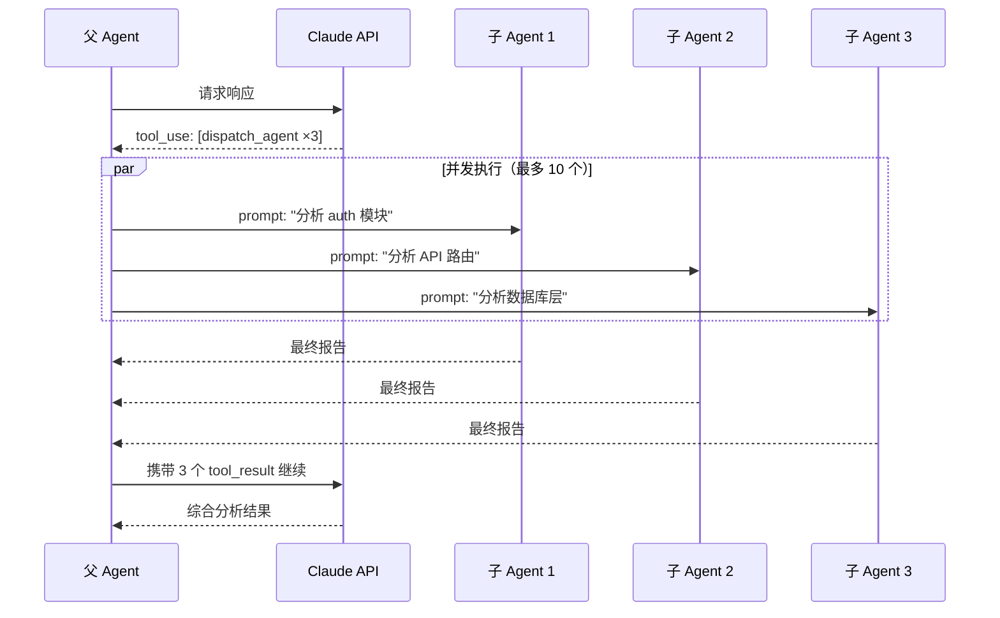
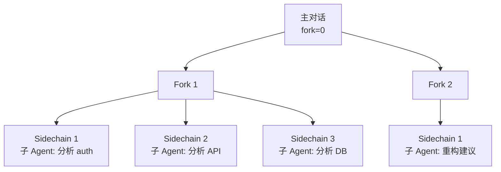
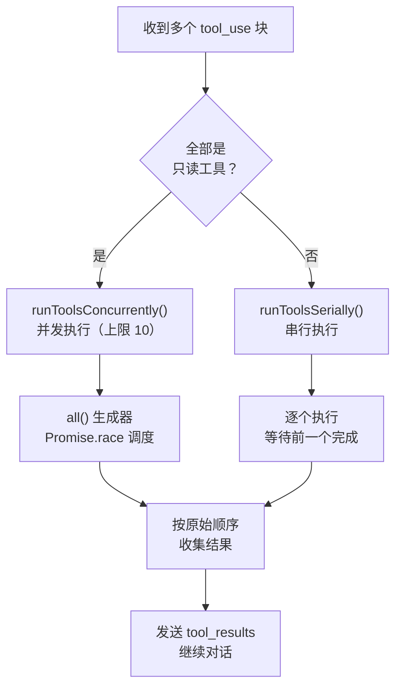
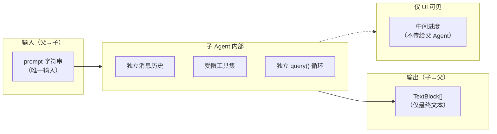

# 01 - Agent 系统（子 Agent 与团队编排）

> 这是 Claude Code 最核心的创新点之一：通过 AgentTool 生成子 Agent，实现任务并行化和上下文隔离。

## 关键文件

| 文件 | 职责 |
|------|------|
| `src/tools/AgentTool/AgentTool.tsx` | Agent 工具主实现 |
| `src/tools/AgentTool/prompt.ts` | Agent 系统 Prompt 与工具过滤逻辑 |
| `src/tools/AgentTool/constants.ts` | 工具名称常量 (`dispatch_agent`) |
| `src/query.ts` | 查询引擎，驱动 Agent 和主 CLI |
| `src/utils/log.ts` | Fork/Sidechain 日志管理 |
| `src/utils/generators.ts` | `all()` 并发生成器执行器 |
| `src/permissions.ts` | Agent 权限作用域 |
| `src/context.ts` | 上下文传递 |

## 架构总览



## 核心设计原则

### 1. 无状态、一次性执行（Fire-and-Forget）

子 Agent 是**完全无状态**的。每次调用：
- 接收一个 `prompt` 字符串作为唯一输入
- 创建全新的消息历史（仅含一条用户消息）
- 运行独立的 `query()` 循环直到完成
- 仅返回最终文本输出给父 Agent

```typescript
// AgentTool.tsx - 简化版
async *call({ prompt }, context) {
  const messages = [createUserMessage(prompt)]   // 全新消息历史
  const tools = await getAgentTools(context)      // 受限工具集

  for await (const message of query(messages, tools, agentPrompt)) {
    yield { type: 'progress', content: message }  // 流式进度（仅 UI）
  }

  // 仅返回最终文本
  const finalText = extractTextBlocks(messages.at(-1))
  yield { type: 'result', content: finalText }
}
```

**关键约束：**
> "Each agent invocation is stateless. You will not be able to send additional messages to the agent, nor will the agent be able to communicate with you outside of its final report."

父 Agent 必须编写**完整、自包含的 Prompt**，因为无法中途补充信息。

### 2. 禁止递归（No Recursive Agents）

子 Agent 的可用工具集中**显式过滤掉了 AgentTool**：

```typescript
// prompt.ts - 工具过滤
export async function getAgentTools(context) {
  const tools = await (
    dangerouslySkipPermissions ? getTools() : getReadOnlyTools()
  )
  return tools.filter(t => t.name !== AgentTool.name)  // ← 过滤自身
}
```

代码注释："No recursive agents, yet..." — 暗示未来可能支持。

### 3. 权限作用域分离

子 Agent 的权限取决于 `dangerouslySkipPermissions` 标志：



### 4. 并发启动多个 Agent

父 Agent 可以在**一条消息中包含多个 `tool_use` 块**，同时启动多个子 Agent：



系统 Prompt 中明确指示：
> "Launch multiple agents concurrently whenever possible, to maximize performance; to do that, use a single message with multiple tool uses."

## Fork 与 Sidechain 系统

每个 Agent 的消息日志保存在独立文件中，通过 fork 和 sidechain 编号区分：

```
日志文件命名规则:
{timestamp}[-{forkNumber}][-sidechain-{sidechainNumber}].json

示例:
2025-02-26T10:30:00.json                    # 主对话
2025-02-26T10:30:00-1.json                  # Fork 1
2025-02-26T10:30:00-1-sidechain-1.json      # Fork 1, 子 Agent 1
2025-02-26T10:30:00-1-sidechain-2.json      # Fork 1, 子 Agent 2
2025-02-26T10:30:00-1-sidechain-3.json      # Fork 1, 子 Agent 3
```



### 竞态条件防护

Sidechain 编号在**执行时**分配，而非创建时：

```typescript
// AgentTool.tsx - 关键注释
// IMPORTANT: Compute sidechain number here, not earlier,
// to avoid a race condition where concurrent Agents reserve
// the same sidechain number.
const sidechainNumber = getNextAvailableLogSidechainNumber()
```

这确保了并发启动的多个 Agent 不会获得相同的 sidechain 编号。

## 并发控制机制

### `all()` 并发生成器

`src/utils/generators.ts` 中的 `all()` 函数是并发执行的核心：

```typescript
// 简化版 all() 实现
async function* all(generators, concurrency) {
  const active = new Set()
  const queue = [...generators]
  const results = []

  // 启动初始批次（不超过并发上限）
  while (active.size < concurrency && queue.length > 0) {
    startNext(queue.shift())
  }

  // 使用 Promise.race 等待任意一个完成
  while (active.size > 0) {
    const { value, gen } = await Promise.race(
      [...active].map(g => g.next().then(v => ({ value: v, gen: g })))
    )

    if (value.done) {
      active.delete(gen)
      if (queue.length > 0) startNext(queue.shift())  // 补充新的
    } else {
      yield value.value  // 流式输出中间结果
    }
  }
}
```

### 并发策略



**`MAX_TOOL_USE_CONCURRENCY = 10`** — 最多同时执行 10 个工具调用。

## Agent 的通信模型



**关键设计决策：**
- 父 Agent 看不到子 Agent 的中间过程（工具调用、思考等）
- 用户可以在终端中看到子 Agent 的实时进度
- 父 Agent 必须主动总结子 Agent 的结果给用户

系统 Prompt 强调：
> "The result returned by the agent is not visible to the user. To show the user the result, you should send a text message back to the user with a concise summary of the result."

## 上下文传递

子 Agent 继承父 Agent 的**项目上下文**（只读、已缓存）：

```typescript
// context.ts - 上下文内容
{
  directoryStructure,  // 项目目录结构快照
  gitStatus,           // Git 状态
  codeStyle,           // 代码风格偏好
  claudeFiles,         // CLAUDE.md 引用
  readme               // 项目 README
}
```

上下文在会话期间**缓存**（memoized），所有子 Agent 共享同一份快照。

## Agent Prompt 设计

`src/tools/AgentTool/prompt.ts` 中定义了子 Agent 的系统 Prompt，关键指令：

1. **角色定义**：明确身份为 "agentic coding assistant"
2. **工具使用规则**：优先使用专用工具而非 Bash
3. **简洁输出**：最多 4 行，除非用户要求详细
4. **安全护栏**：不生成恶意代码
5. **环境信息**：工作目录、平台、模型等

## 与现代 Agent 框架的对比

| 特性 | Claude Code v0.2.8 | 现代 Agent 框架（如 CrewAI） |
|------|--------------------|-----------------------------|
| Agent 通信 | 无状态、一次性 | 多轮对话、共享记忆 |
| 递归 | 禁止 | 通常支持 |
| 并发 | 通过 tool_use 并发 | 显式任务队列 |
| 角色分工 | 单一通用 Agent | 可定义不同角色 |
| 上下文共享 | 只读项目上下文 | 共享黑板/记忆 |
| 编排 | 隐式（模型决定） | 显式工作流 |

## 学习建议

1. **先读** `AgentTool.tsx`（~200 行）— 理解整体流程
2. **再读** `prompt.ts`（~50 行）— 理解工具过滤和 Prompt
3. **然后读** `query.ts` 中的 `runToolsConcurrently()`— 理解并发机制
4. **接着读** `utils/generators.ts` 中的 `all()`— 理解底层并发原语
5. **最后读** `utils/log.ts` 中的 fork/sidechain 函数 — 理解日志隔离
