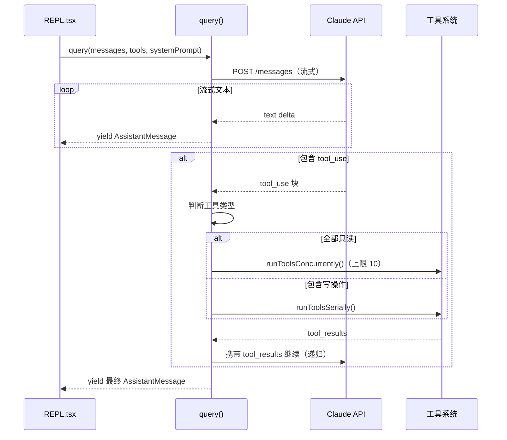
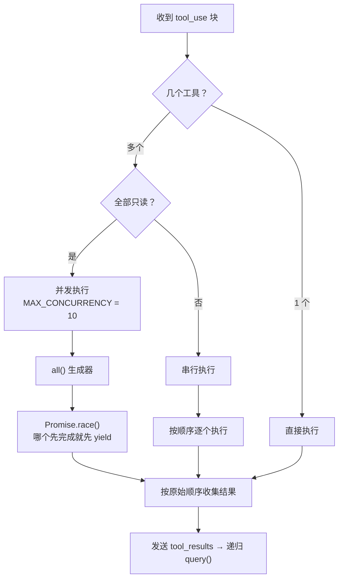
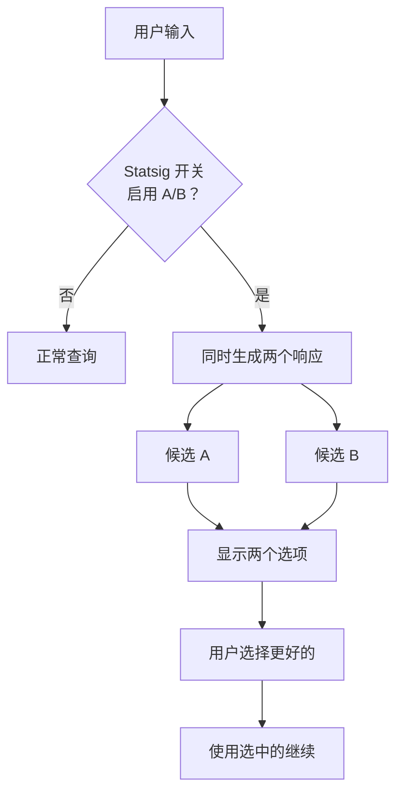

# 02 - 查询循环（核心引擎）

> 查询循环是 Claude Code 的心脏 — 驱动所有交互，包括主 REPL 和子 Agent。

## 关键文件

| 文件 | 职责 |
|------|------|
| `src/query.ts` | 核心查询生成器，工具编排 (15 KB) |
| `src/screens/REPL.tsx` | 主交互循环，消费查询结果 (22 KB) |
| `src/utils/generators.ts` | `all()` 并发生成器 |

## 查询流程



## 核心代码结构

### query() 生成器

```typescript
async function* query(messages, tools, systemPrompt) {
  // 1. 调用 Claude API
  const response = await querySonnet(messages, tools, systemPrompt)

  // 2. 提取 tool_use 块
  const toolUses = response.content.filter(b => b.type === 'tool_use')

  if (toolUses.length === 0) {
    yield response  // 无工具调用，直接返回
    return
  }

  // 3. 执行工具
  const allReadOnly = toolUses.every(t => findTool(t).isReadOnly())
  const results = allReadOnly
    ? yield* runToolsConcurrently(toolUses, concurrency: 10)
    : yield* runToolsSerially(toolUses)

  // 4. 递归继续对话
  messages.push(response, ...results)
  yield* query(messages, tools, systemPrompt)  // 递归
}
```

### REPL 消费模式

```typescript
// REPL.tsx - 简化版
async function onQuery(userMessage) {
  messages.push(userMessage)

  for await (const message of query(messages, tools, systemPrompt)) {
    if (message.type === 'progress') {
      updateToolUI(message)        // 更新工具执行进度
    } else if (message.type === 'result') {
      messages.push(message)       // 追加到消息历史
      renderMessage(message)       // 渲染到终端
    }
  }
}
```

## 并发策略



## Binary Feedback（A/B 测试）

仅对 Anthropic 内部用户启用：



## 学习建议

1. **先读** `query.ts` 的 `query()` 函数 — 理解递归流式模式
2. **再读** `runToolsConcurrently()` 和 `runToolsSerially()` — 理解并发策略
3. **然后读** `REPL.tsx` 的 `onQuery` — 理解消费端
