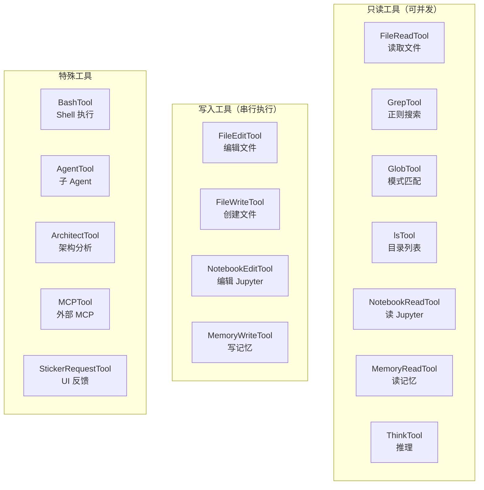

# 03 - 工具系统（插件架构）

> 18 个内置工具，统一接口，Zod 校验，权限控制，流式输出。

## 关键文件

| 文件 | 职责 |
|------|------|
| `src/tools.ts` | 工具注册表 |
| `src/tools/*/index.tsx` | 各工具实现 |
| `src/Tool.ts` | 工具接口定义（运行时） |

## 工具接口

每个工具都实现统一的接口：

```typescript
interface Tool {
  // 标识
  name: string                                      // 内部 ID
  userFacingName(): string                          // 显示名称

  // 描述与 Prompt
  description(schema): Promise<string>              // 用于 system prompt
  prompt(): Promise<string>                         // 工具专属指令

  // 校验
  inputSchema: ZodSchema                            // Zod 输入校验
  validateInput(input, context): Promise<Result>    // 自定义校验

  // 状态
  isReadOnly(): boolean                             // 影响并发策略
  isEnabled(): Promise<boolean>                     // 运行时可用性

  // 权限
  needsPermissions(input): boolean                  // 是否需要授权

  // 执行
  async *call(input, context): AsyncGenerator       // 流式执行

  // UI 渲染
  renderToolUseMessage(input): ReactNode            // 调用时 UI
  renderToolResultMessage(output): ReactNode        // 结果 UI
  renderToolUseRejectedMessage(input): ReactNode    // 拒绝时 UI
  renderResultForAssistant(data): unknown           // 返回给模型的格式
}
```

## 工具分类



## 各工具详解

### BashTool
- **功能**：执行 Shell 命令
- **持久 Shell**：使用 `PersistentShell`，命令间保留状态（cd 等）
- **安全限制**：禁止危险命令（如 `rm -rf /`）、校验 cd 不逃离工作目录
- **输出**：返回 stdout/stderr 及行数统计

### FileEditTool
- **功能**：通过 `old_string` → `new_string` 应用编辑
- **编码检测**：自动处理文件编码和换行符
- **UI**：显示结构化 Diff 预览
- **权限**：每个会话首次写入需授权

### FileReadTool
- **功能**：读取文件内容，支持分页
- **图片支持**：图片文件 base64 编码后返回
- **语法高亮**：根据扩展名自动识别语言
- **大文件**：超出限制时截断，支持 offset/limit

### GrepTool
- **功能**：使用 ripgrep 正则搜索
- **输入**：pattern, path, include filter
- **输出**：最多 100 个匹配文件

### GlobTool
- **功能**：快速文件模式匹配
- **输出**：文件列表 + 是否截断标志

### MCPTool
- **功能**：代理外部 MCP 服务器的工具
- **动态注册**：运行时从 MCP 服务器获取工具列表
- **命名规则**：`mcp__servername__toolname`

### MemoryReadTool / MemoryWriteTool
- **功能**：基于文件系统的跨会话记忆读写
- **存储位置**：`${CLAUDE_CONFIG_DIR ?? ~/.claude}/memory`
- **默认读取行为**：不传 `file_path` 时返回根 `index.md` 内容和整个记忆目录文件列表
- **当前状态**：只在 `USER_TYPE === 'ant'` 时进入工具注册表，但又被 `isEnabled() => false` 过滤，默认构建中不可见
- **延伸阅读**：见 [13-memory-system.md](./13-memory-system.md)

## 工具执行上下文

```typescript
interface ToolUseContext {
  abortController: AbortController    // 取消控制
  options: {
    dangerouslySkipPermissions: boolean
    forkNumber: number
    messageLogName: string
    slowAndCapableModel: string
    maxThinkingTokens: number
  }
  readFileTimestamps: Map<string, number>  // 文件修改追踪
  messageId: string
}
```

## 学习建议

1. **先读** `tools.ts` — 理解工具注册和分组
2. **选读** 2-3 个工具的 `index.tsx` — 理解接口实现模式
3. **推荐**：BashTool（最复杂）→ FileReadTool（最简洁）→ MCPTool（动态注册）
