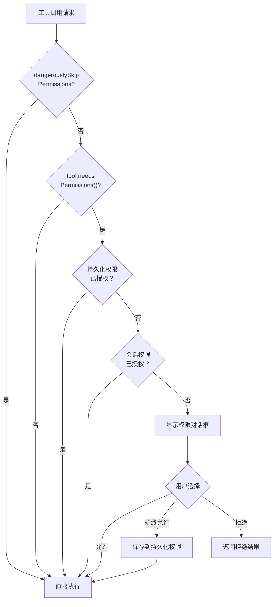
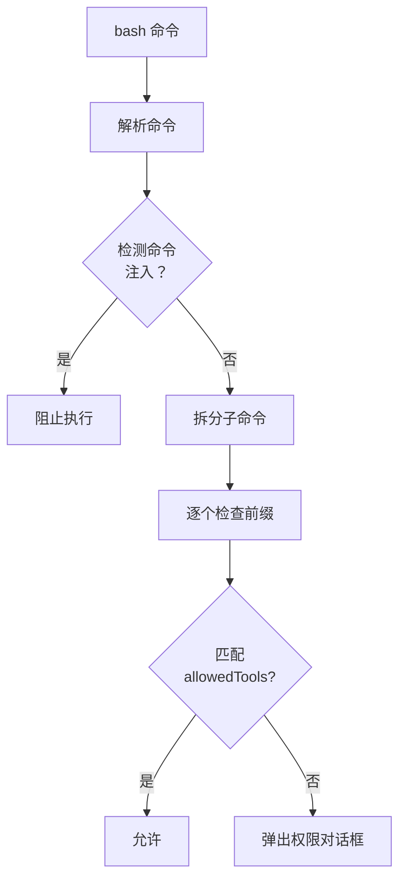

# 04 - 权限系统

> 两级权限模型：持久化权限（磁盘）+ 会话权限（内存），保障安全的同时减少打扰。

## 关键文件

| 文件 | 职责 |
|------|------|
| `src/permissions.ts` | 权限检查核心逻辑 |
| `src/components/permissions/` | 权限对话框 UI 组件 |
| `src/hooks/useCanUseTool.ts` | 权限检查 React Hook |

## 权限检查流程



## 两级权限模型

### 第一级：持久化权限（磁盘）

存储在 `.claude/config` 的 `allowedTools` 列表中：

```json
{
  "allowedTools": [
    "BashTool(npm:*)",
    "BashTool(git:*)",
    "FileEditTool",
    "FileWriteTool"
  ]
}
```

- **BashTool**：支持命令前缀匹配（如 `npm:*` 允许所有 npm 命令）
- **其他工具**：简单的工具名匹配

### 第二级：会话权限（内存）

- FileEditTool、FileWriteTool、NotebookEditTool 每个会话首次使用时询问
- 授权后通过 `grantWritePermissionForOriginalDir()` 保存在内存中
- 会话结束后失效

## BashTool 权限特殊处理



## 权限 UI 组件

| 组件 | 用途 |
|------|------|
| `BashPermissionRequest` | Shell 命令授权，显示命令和描述 |
| `FileEditPermissionRequest` | 文件编辑授权，显示 Diff 预览 |
| `FilesystemPermissionRequest` | 文件系统读取授权 |
| `PermissionRequest` | 调度器，路由到具体组件 |

用户选项：
- **允许**（仅本次）
- **始终允许**（保存到持久化权限）
- **拒绝**
