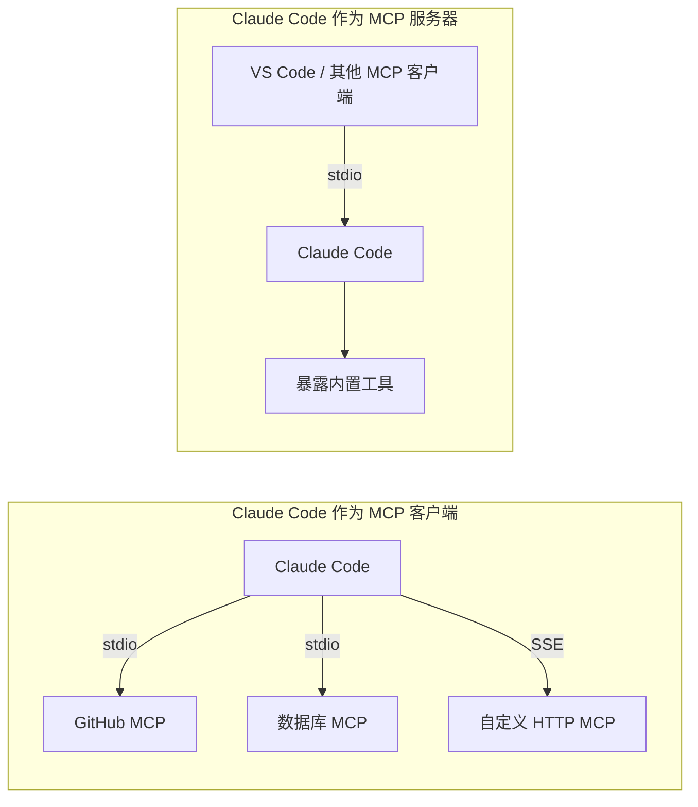
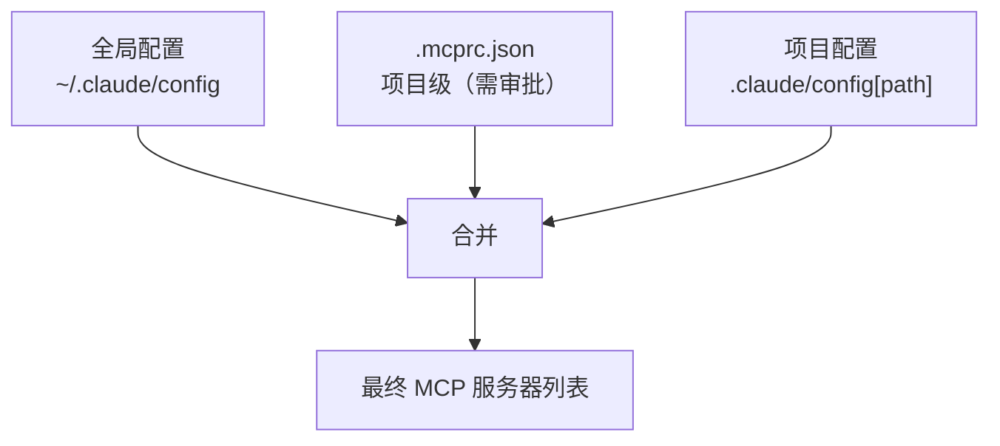
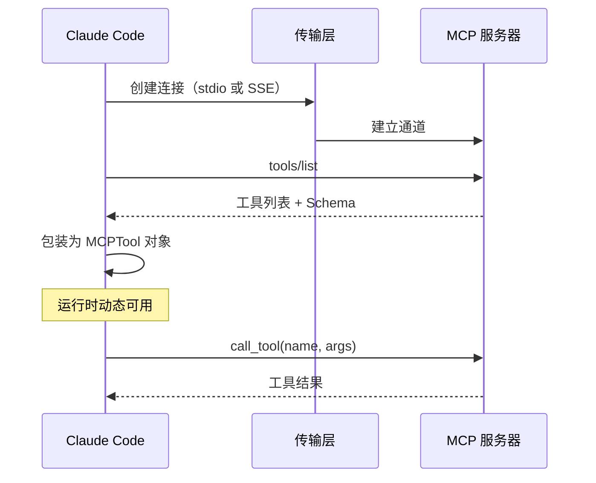
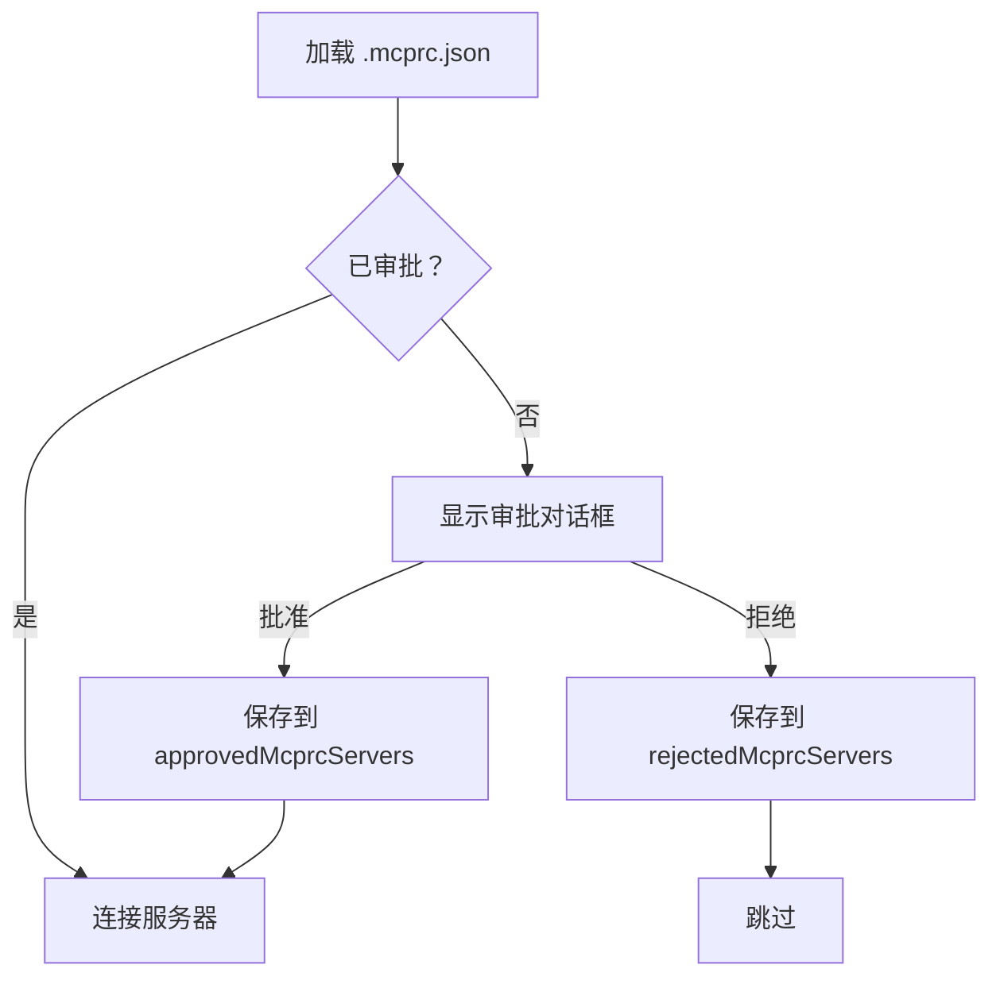

# 05 - MCP 系统（Model Context Protocol）

> Claude Code 同时是 MCP 客户端和 MCP 服务器，实现了工具系统的动态扩展。

## 关键文件

| 文件 | 职责 |
|------|------|
| `src/services/mcpClient.ts` | MCP 客户端实现 (15 KB) |
| `src/entrypoints/mcp.ts` | MCP 服务器入口 (5.2 KB) |
| `src/tools/MCPTool/` | MCP 工具代理 |

## 双重角色



## MCP 客户端

### 配置层级



### 连接流程



### 传输类型

| 类型 | 说明 | 连接方式 |
|------|------|----------|
| **Stdio** | 子进程通信 | 启动子进程，通过 stdin/stdout |
| **SSE** | HTTP 服务器事件 | 连接到 HTTP URL |

- 连接超时：5 秒
- stderr 输出记录到 `logMCPError` 用于调试

### 工具包装

外部 MCP 工具被包装为标准 Tool 接口：
- 命名规则：`mcp__<servername>__<toolname>`
- Schema 从 MCP `tools/list` 响应中提取
- 执行通过 `callMCPTool()` 代理到原始 MCP 服务器

## MCP 服务器模式

`src/entrypoints/mcp.ts` 将 Claude Code 自身作为 MCP 服务器暴露：

```typescript
// 暴露的工具集
const tools = [AgentTool, BashTool, FileEditTool, FileReadTool,
               FileWriteTool, GlobTool, GrepTool, lsTool, NotebookEditTool]
```

用途：其他 MCP 客户端（如 VS Code 扩展）可以通过 MCP 协议调用 Claude Code 的工具。

## 审批机制

`.mcprc.json` 中的 MCP 服务器需要用户审批后才能使用：


