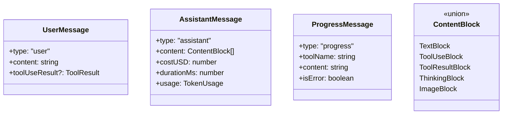
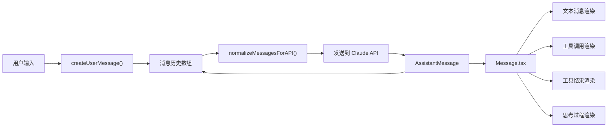

# 06 - 消息处理

> 消息的创建、标准化和渲染，是连接查询循环与 UI 的桥梁。

## 关键文件

| 文件 | 职责 |
|------|------|
| `src/utils/messages.tsx` | 消息创建与标准化 (25 KB) |
| `src/components/Message.tsx` | 消息渲染调度 |
| `src/components/messages/` | 各消息类型渲染器 |

## 消息类型

## 消息流

## 标准化

`normalizeMessages()` 的职责：
- 展平合成消息（中断、拒绝等）
- 跟踪 tool_use ID，确保 tool_result 正确关联
- 处理流式消息的部分状态

`normalizeMessagesForAPI()` 的职责：
- 转换为 `MessageParam[]` 格式
- 移除 UI-only 字段（cost、duration 等）
- 合成消息（如权限拒绝）转为标准格式

## 合成消息

系统会在特定场景创建"合成"消息：

| 场景 | 合成内容 |
|------|----------|
| 用户中断 | 创建 AssistantMessage 标记中断 |
| 权限拒绝 | 创建 tool_result 说明拒绝原因 |
| 工具错误 | 创建 error tool_result |
| Agent 返回 | 将 Agent 输出包装为 tool_result |
