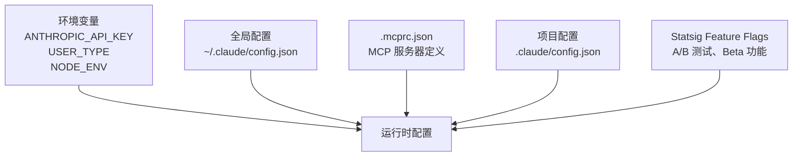
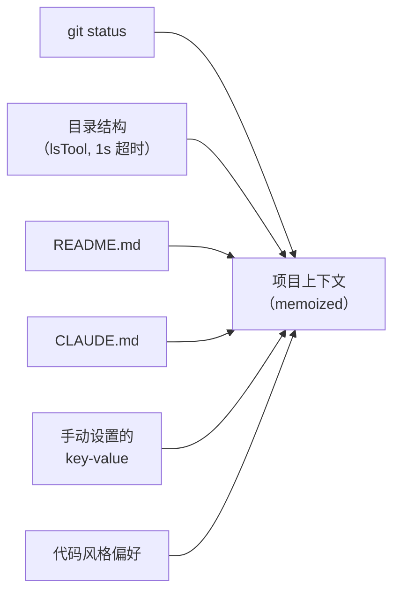

# 07 - 配置系统

> 多层配置合并：全局 → mcprc → 项目级，加上环境变量和 Feature Flags。

## 关键文件

| 文件 | 职责 |
|------|------|
| `src/utils/config.ts` | 配置读写 |
| `src/context.ts` | 项目上下文构建 (6.7 KB) |

## 配置层级

## 全局配置

`~/.claude/config.json` 中的主要字段：

| 字段 | 说明 |
|------|------|
| `primaryApiKey` | API 密钥 |
| `theme` | 终端主题 |
| `hasCompletedOnboarding` | 是否完成首次设置 |
| `numStartups` | 启动次数 |
| `autoUpdaterStatus` | 自动更新状态 |
| `verbose` | 详细输出 |
| `mcpServers` | 全局 MCP 服务器 |

## 项目配置

`~/.claude/config[项目路径]` 中的主要字段：

| 字段 | 说明 |
|------|------|
| `allowedTools` | 已授权工具列表 |
| `context` | 手动设置的上下文键值对 |
| `history` | 命令历史 |
| `mcpServers` | 项目级 MCP 服务器 |
| `dontCrawlDirectory` | 跳过自动目录扫描 |
| `enableArchitectTool` | 启用架构工具 |

## 项目上下文

`context.ts` 自动收集的上下文信息：

上下文在会话期间**缓存**，不会重复计算。通过 `/context` 命令可查看和修改。
