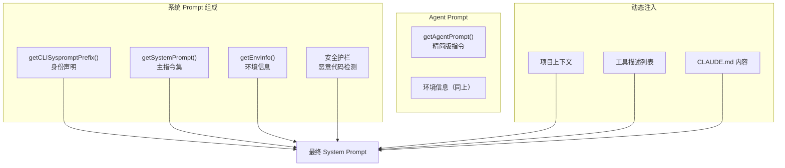

# 08 - 系统 Prompt

> Prompt 工程是 Claude Code 行为的根本驱动力，定义了 Agent 的能力边界和行为规范。

## 关键文件

| 文件 | 职责 |
|------|------|
| `src/constants/prompts.ts` | 所有系统 Prompt (11 KB) |

## Prompt 结构

## 主要指令分类

### 行为规范
- 简洁输出（最多 4 行，除非要求详细）
- 不加前言/后语
- 不猜测用户意图

### 工具使用规则
- 优先使用专用工具而非 Bash
- 修改文件前先检查 help 输出
- 编辑后运行 lint/typecheck

### 安全约束
- 不生成恶意代码
- 不直接提交到 main/master
- 不执行除非被明确要求

### 环境信息（动态）
- 当前工作目录
- 操作系统和平台
- 当前日期
- Git 仓库状态
- 使用的模型

## CLI Prompt vs Agent Prompt

| 维度 | CLI Prompt | Agent Prompt |
|------|-----------|--------------|
| 复杂度 | 完整指令集 | 精简版 |
| 工具列表 | 全部 18 个 | 过滤后子集 |
| 权限说明 | 详细 | 简化 |
| 安全护栏 | 完整 | 核心部分 |
| 上下文 | 完整项目上下文 | 共享缓存的上下文 |
