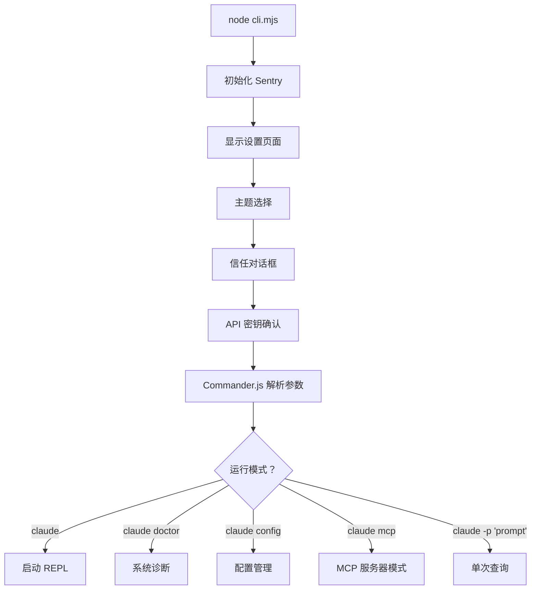
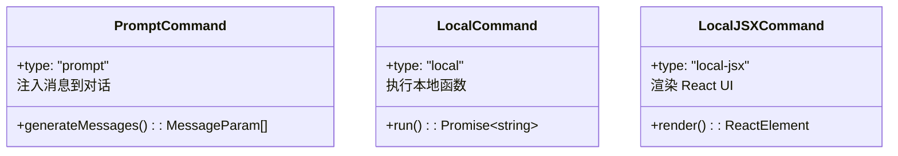

# 09 - CLI 与命令系统

> 入口点解析、斜杠命令注册、屏幕路由。

## 关键文件

| 文件 | 职责 |
|------|------|
| `src/entrypoints/cli.tsx` | 主入口 (32 KB) |
| `src/commands.ts` | 命令注册表 |
| `src/commands/` | 21 个命令实现 |

## 启动流程

## 命令类型

## 可用命令

| 命令 | 类型 | 功能 |
|------|------|------|
| `/bug` | LocalJSX | Bug 报告 |
| `/clear` | Local | 清除对话 |
| `/compact` | Prompt | 压缩上下文 |
| `/config` | LocalJSX | 配置管理 |
| `/cost` | Local | 显示费用 |
| `/doctor` | LocalJSX | 系统诊断 |
| `/help` | LocalJSX | 帮助信息 |
| `/init` | Local | 项目初始化 |
| `/login` | LocalJSX | 登录 |
| `/logout` | LocalJSX | 登出 |
| `/pr_comments` | Prompt | PR 评论处理 |
| `/review` | Prompt | 代码审查 |
| `/resume` | LocalJSX | 恢复对话 |

此外，MCP 服务器的 prompt 也会动态注册为命令。
