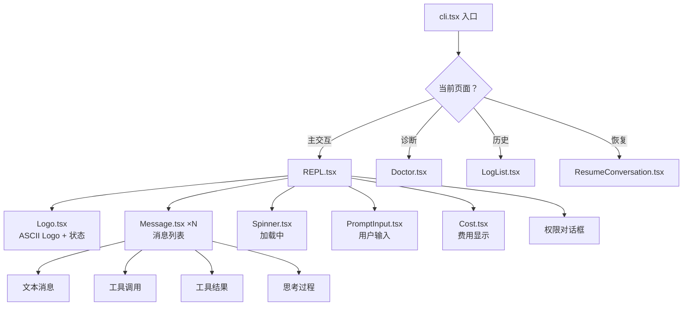

# 10 - UI 组件（React/Ink 终端 UI）

> 40+ React 组件通过 Ink 框架渲染到终端，包括消息、输入、Diff 预览、权限对话框等。

## 关键文件

| 文件 | 职责 |
|------|------|
| `src/screens/REPL.tsx` | 主页面 |
| `src/components/PromptInput.tsx` | 用户输入框 |
| `src/components/Message.tsx` | 消息渲染调度 |
| `src/components/StructuredDiff.tsx` | Diff 查看器 |
| `src/components/Onboarding.tsx` | 首次设置 |
| `src/components/Spinner.tsx` | 加载动画 |
| `src/components/Logo.tsx` | ASCII Logo |

## UI 层级

## 核心组件

### PromptInput
- 输入框，支持 Bash/Prompt 模式切换
- 斜杠命令自动补全（typeahead）
- 方向键历史导航
- Token 警告（上下文接近限制时）

### StructuredDiff
- 渲染 Diff hunks，带行号
- 绿色 = 新增，红色 = 删除
- 自动换行适应终端宽度
- 用于 FileEdit 权限预览

### Message
- 调度器模式：根据消息类型路由到具体渲染器
- 支持：文本、工具调用、工具结果、思考过程、图片
- 错误/进行中/未解决状态指示

## 技术栈

- **Ink**：React → 终端渲染
- **Yoga**（WASM）：Flexbox 布局计算
- **Chalk**：终端颜色
- **Chroma**：语法高亮
