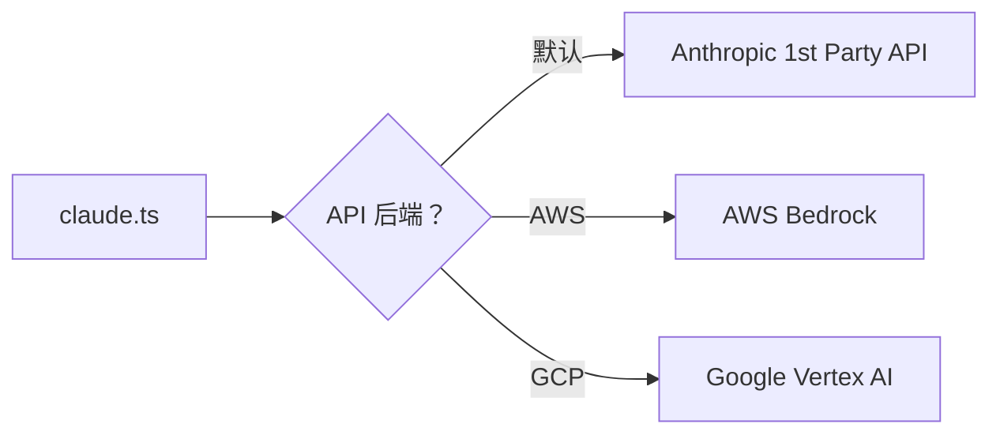

# 11 - 服务层

> API 客户端、费用追踪、错误上报、Feature Flags、OAuth。

## 关键文件

| 文件 | 职责 |
|------|------|
| `src/services/claude.ts` | Anthropic API 客户端 (28 KB) |
| `src/cost-tracker.ts` | 费用追踪 |
| `src/services/sentry.ts` | 错误上报 |
| `src/services/statsig.js` | Feature Flags / 分析 |
| `src/services/oauth.ts` | OAuth 认证 |

## API 客户端

### 多后端支持



### 重试机制

- 最多 10 次重试
- 指数退避，最大 32 秒
- 自动重试状态码：408, 409, 429, 5xx

### Prompt 缓存

- 默认启用（除非 `DISABLE_PROMPT_CACHING`）
- 缓存读取成本远低于完整输入

### 主要函数

| 函数 | 用途 |
|------|------|
| `querySonnet()` | 主查询，带工具 Schema 和 thinking tokens |
| `queryHaiku()` | 快速小模型，用于描述生成、校验 |
| `verifyApiKey()` | 快速认证检查 |
| `formatSystemPromptWithContext()` | 合并 Prompt 和上下文 |

## 费用追踪

### 计费模型

| 模型 | 输入 | 输出 | 缓存写入 | 缓存读取 |
|------|------|------|----------|----------|
| Haiku | $0.80/M | $4.00/M | $1.00/M | $0.08/M |
| Sonnet | $3.00/M | $15.00/M | $3.75/M | $0.30/M |

### 追踪状态

```typescript
STATE = {
  totalCost: number,        // 累计费用（USD）
  totalAPIDuration: number, // 累计 API 耗时（ms）
  startTime: number         // 会话开始时间
}
```

- 超过 $5 时弹出提醒对话框
- 退出时保存费用到项目配置

## 错误上报（Sentry）

- 自动上报未捕获异常
- 包含会话 ID、用户类型等上下文
- 可通过配置关闭

## Feature Flags（Statsig）

- Binary Feedback A/B 测试
- 模型选择门控
- 自动更新器开关
- 各种 Beta 功能
