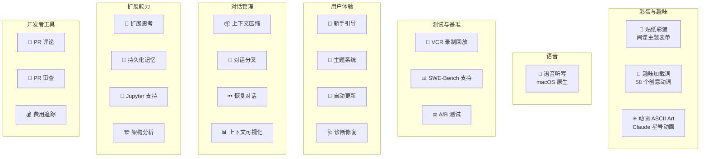

# 12 - 非核心功能与彩蛋

> Claude Code 除了核心的 Agent/工具/查询系统外，还有大量有趣的边缘功能和彩蛋。

## 功能总览



---

## 彩蛋与趣味功能

### 贴纸彩蛋（Sticker Easter Egg）

**文件：**
- `src/tools/StickerRequestTool/StickerRequestTool.tsx`
- `src/components/StickerRequestForm.tsx`（523 行）
- `src/tools/StickerRequestTool/prompt.ts`

**Statsig 开关：** `tengu_sticker_easter_egg`

这是一个精心设计的间谍主题彩蛋。当用户触发特定关键词时，会显示一个"机密"表单：

```
╔══════════════════════════════╗
║         CLASSIFIED           ║
╚══════════════════════════════╝
You've discovered Claude's top secret sticker distribution operation!
```

**特点：**
- 完整的间谍任务主题（"请提供你的坐标以执行贴纸部署任务"）
- 收集邮寄地址（仅限美国）
- 自动在浏览器中打开预填写的 Google 表单
- "Esc 中止任务" / "任务不可用"（非美国地区）
- 动画 Claude 星号随表单显示
- 根据终端高度自适应 ASCII Art 大小

### 趣味加载消息（Spinner）

**文件：** `src/components/Spinner.tsx`

加载时随机显示 58 个创意动词，其中包括：

| 正常词汇 | 有趣词汇 | 彩蛋词汇 |
|----------|----------|----------|
| Thinking | Clauding | Reticulating（SimCity 梗）|
| Computing | Noodling | Honking |
| Processing | Smooshing | Finagling |
| Generating | Vibing | Schlepping |
| Crafting | Puttering | Moseying |

动画符号序列：`·` → `✢` → `✳` → `∗` → `✻` → `✽`（macOS；Windows/Linux 有兼容处理）

### 动画 Claude 星号

**文件：**
- `src/components/AnimatedClaudeAsterisk.tsx`
- `src/constants/claude-asterisk-ascii-art.tsx`（239 行）

- **大号动画**：10 帧呼吸/脉动效果的 ASCII 星号
- **小号动画**：7 帧符号旋转（`@` → `*` → `+` → `/` → `|` → `\` → `-`）
- 用于贴纸表单和欢迎页面

---

## 语音听写

### `/listen` 命令

**文件：** `src/commands/listen.ts`

| 属性 | 值 |
|------|-----|
| 平台 | 仅 macOS（iTerm 或 Apple Terminal）|
| 实现 | AppleScript 调用系统听写 |
| 可见性 | 仅 Anthropic 内部用户（`USER_TYPE === 'ant'`）|
| 外部依赖 | 无（使用 macOS 原生听写）|

```typescript
// 核心实现
execFileNoThrow('osascript', ['-e',
  'tell application "System Events" to tell process "iTerm2" ' +
  'to click menu item "Start Dictation" of menu "Edit" of menu bar 1'
])
```

极简实现 — 直接调用 macOS 系统听写，不依赖任何第三方语音库。

---

## 测试与基准功能

### Binary Feedback（A/B 测试）

**文件：** `src/components/binary-feedback/`

仅对 Anthropic 内部用户启用：
- 同时生成两个 Claude 响应
- 并排显示供用户选择更好的一个
- 选择结果记录到分析系统

### VCR 录制回放

**文件：** `src/services/vcr.ts`

用于确定性测试的 API 响应录制/回放：
- 对消息内容做哈希生成 fixture 文件名
- 开发时缓存 API 响应
- 脱水/水化处理（移除不确定数据：文件数、耗时、费用、路径）
- 无需重复 API 调用即可运行测试

### SWE-Bench 基准测试

跨多个文件的特殊处理：
- **重试策略**：100 次重试（正常 10 次）
- **过载检测**：SWE-Bench 专用的过载错误处理
- **事件追踪**：`SWE_BENCH_RUN_ID` 集成到 Statsig

---

## 用户体验功能

### 新手引导（Onboarding）

**文件：** `src/components/Onboarding.tsx`, `src/ProjectOnboarding.tsx`

首次运行的交互式设置：
1. 主题选择（4 个选项）
2. OAuth 认证
3. API 密钥确认（ANT 用户）
4. 安全提示
5. 使用技巧

### 主题系统

**文件：** `src/utils/theme.ts`

4 个主题，包含色盲友好变体：

| 主题 | 说明 |
|------|------|
| `dark` | 深色（默认）|
| `light` | 浅色 |
| `dark-daltonized` | 深色色盲友好 |
| `light-daltonized` | 浅色色盲友好 |

语义化颜色：success、error、warning、diff（added/removed + dimmed 变体）

### 自动更新

**文件：** `src/components/AutoUpdater.tsx`, `src/utils/autoUpdater.ts`

- 每 30 分钟自动检查新版本
- 通过 npm 静默安装
- 文件锁防止并发更新
- 最低版本强制（Statsig 配置）
- 权限问题时优雅降级

### 系统诊断（Doctor）

**文件：** `src/screens/Doctor.tsx`

诊断并修复 npm 权限问题：
- 检查 npm 全局写权限
- 三种修复路径：手动权限修复 / 自动 npm prefix 设置 / 跳过
- 生成平台特定命令（Windows icacls / Unix chown）
- 更新 shell 配置文件（.bashrc, .zshrc, .fish/config.fish）

---

## 对话管理功能

### 上下文压缩（`/compact`）

**文件：** `src/commands/compact.ts`

- 使用 Claude 生成当前对话摘要
- 清除消息历史
- 用摘要开始新对话
- 重置 token 计数器
- 清除缓存（上下文、代码风格）

### 对话分叉（Fork）

- 允许从对话中的任意点创建分支
- 通过 `forkNumber` 追踪分支
- 与 Agent 的 sidechain 系统共享编号机制

### 恢复对话（`/resume`）

**文件：** `src/commands/resume.tsx`（仅 ANT 用户）

- 从历史消息日志中选择恢复
- 加载完整消息历史
- 继续中断的对话

### 上下文可视化（`/ctx_viz`）

**文件：** `src/commands/ctx_viz.ts`

- 分段展示发送给 Claude 的上下文
- 估算 Token 用量（约 4 字节/Token）
- 显示工具描述和 Schema
- 表格化输出

---

## 扩展能力

### 扩展思考（Extended Thinking）

**文件：** `src/tools/ThinkTool/ThinkTool.tsx`, `src/utils/thinking.ts`

根据用户关键词动态分配思考 Token：

| 关键词 | Token 分配 |
|--------|-----------|
| "think" | 4,096 |
| "think hard" | 10,000 |
| "think super hard" | 32,000 |

Statsig 开关：`tengu_think_tool`

### 持久化记忆

**文件：** `src/tools/MemoryReadTool/`, `src/tools/MemoryWriteTool/`

- 基于文件的跨会话记忆存储
- 存储目录为 `${CLAUDE_CONFIG_DIR ?? ~/.claude}/memory`
- 根记忆文件约定为 `index.md`，不传 `file_path` 时会读取它并列出全部记忆文件
- `MemoryWriteTool` 会自动创建父目录，并直接覆盖目标文件内容
- 只对 `USER_TYPE === 'ant'` 注册，但当前版本 `isEnabled()` 硬编码返回 `false`
- 更多实现细节见 [13-memory-system.md](./13-memory-system.md)

### Jupyter Notebook 支持

**文件：** `src/tools/NotebookReadTool/`, `src/tools/NotebookEditTool/`

- 读取 notebook cells（JSON 解析）
- 编辑操作：替换、插入、删除
- 支持 code 和 markdown cells
- 保留 metadata（kernel info、execution count）

### 架构分析工具（Architect）

**文件：** `src/tools/ArchitectTool/`

- 仅读取操作，不修改代码
- 使用专用系统 Prompt
- **当前状态：已禁用**（`isEnabled` 返回 false）
- 通过项目配置的 `enableArchitectTool` 可手动启用

---

## 开发者工具

### PR 评论（`/pr-comments`）

**文件：** `src/commands/pr_comments.ts`

- 使用 `gh` CLI 获取 GitHub PR 评论
- 合并 PR 级别和代码审查评论
- 显示 diff hunks 和行号
- 保留评论线程结构

### PR 审查（`/review`）

**文件：** `src/commands/review.ts`

- 列出待审 PR
- 获取详情和 diff
- 提供结构化代码审查
- 分析维度：代码质量、风格、性能、测试覆盖、安全

### 费用追踪（`/cost`）

**文件：** `src/commands/cost.ts`, `src/cost-tracker.ts`

- 实时累计 API 费用
- 超过 $5 弹出提醒（`CostThresholdDialog`）
- 退出时保存到项目配置

---

## 内部用户 vs 外部用户功能矩阵

| 功能 | 外部用户 | ANT 内部用户 |
|------|---------|-------------|
| 核心 REPL | ✓ | ✓ |
| 所有工具 | ✓ | ✓ |
| `/listen` 语音 | ✗ | ✓ |
| `/resume` 恢复 | ✗ | ✓ |
| Binary Feedback | ✗ | ✓ |
| 贴纸彩蛋 | Statsig 控制 | Statsig 控制 |
| 扩展思考 | Statsig 控制 | Statsig 控制 |
| SWE-Bench 模式 | ✗ | ✗（需 `USER_TYPE=SWE_BENCH`）|
