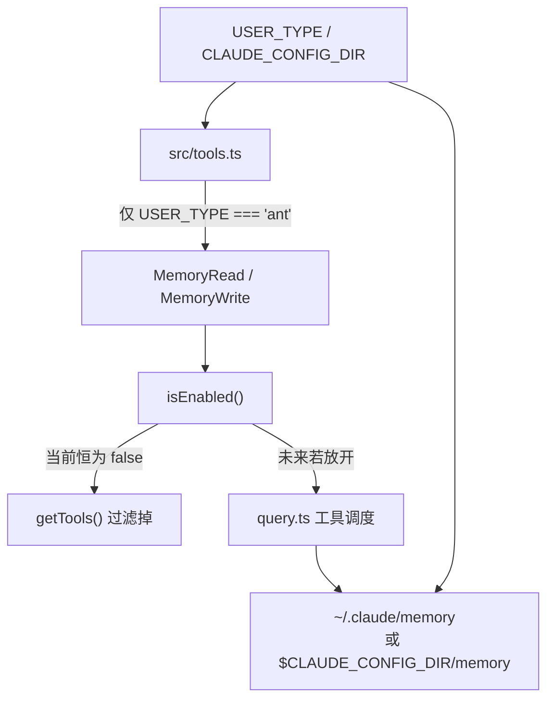

# 13 - 记忆系统（隐藏的持久化记忆）

> 一个已经接上工具框架、但在 v0.2.8 中默认关闭的 file-backed memory feature。

## 关键文件

| 文件 | 职责 |
|------|------|
| `src/tools/MemoryReadTool/MemoryReadTool.tsx` | 读取根记忆索引或指定记忆文件 |
| `src/tools/MemoryWriteTool/MemoryWriteTool.tsx` | 写入/覆盖记忆文件 |
| `src/tools.ts` | 将 Memory 工具标记为 ANT-only，并参与统一启用过滤 |
| `src/utils/env.ts` | 定义 `CLAUDE_BASE_DIR` 和 `MEMORY_DIR` |

## 它是怎么接进系统的



当前版本里，Memory 工具虽然已经写好了实现，但正常流程下不会真正暴露给模型：

1. `src/tools.ts` 中的 `ANT_ONLY_TOOLS` 包含 `MemoryReadTool` 和 `MemoryWriteTool`
2. 只有 `process.env.USER_TYPE === 'ant'` 时，它们才会进入 `getAllTools()`
3. `getTools()` / `getReadOnlyTools()` 又会统一调用每个工具的 `isEnabled()`
4. 两个 Memory 工具目前都直接 `return false`

结果就是：代码存在，注册链路也存在，但默认构建里这个能力实际上是关闭的。

## 存储模型

`src/utils/env.ts` 定义了两层路径：

```typescript
export const CLAUDE_BASE_DIR =
  process.env.CLAUDE_CONFIG_DIR ?? join(homedir(), '.claude')

export const MEMORY_DIR = join(CLAUDE_BASE_DIR, 'memory')
```

所以默认目录结构是：

```text
~/.claude/
  memory/
    index.md
    projects/
      foo.md
    people/
      bar.md
```

这里没有数据库、向量索引或额外元数据层，本质上就是一个受约束的文件树。

## MemoryReadTool

输入 schema 很简单：

```typescript
{
  file_path?: string
}
```

行为分两种：

### 1. 不传 `file_path`

- 确保 `MEMORY_DIR` 存在（`mkdirSync(..., { recursive: true })`）
- 尝试读取根文件 `index.md`
- 递归列出整个记忆目录内的文件
- 返回给模型一段组合文本：
  - 根记忆文件内容
  - 所有记忆文件路径列表

这说明 `index.md` 是“入口记忆”，但不是强制 schema；其他文件只是普通文本文件。

### 2. 传入 `file_path`

- 将相对路径解析到 `MEMORY_DIR` 下
- 校验目标路径必须仍然位于 memory 目录内
- 目标必须存在，且必须是文件而不是目录
- 直接用 `readFileSync(..., 'utf-8')` 返回全文

没有分页、摘要或分块逻辑，所以它更像“读取个人知识库文件”而不是大规模 memory retrieval。

## MemoryWriteTool

输入 schema：

```typescript
{
  file_path: string
  content: string
}
```

写入流程也非常直接：

1. 把 `file_path` 解析到 `MEMORY_DIR`
2. 校验解析后的路径仍在 memory 根目录内
3. `mkdirSync(dirname(fullPath), { recursive: true })`
4. `writeFileSync(fullPath, content, 'utf-8')`

几个重要含义：

- 是**整文件覆盖**，不是 append，也没有 patch/merge 语义
- 支持多级子目录
- 没有额外权限弹窗，`needsPermissions()` 直接返回 `false`
- 返回给模型的结果只有 `"Saved"`，非常薄

## 安全边界与限制

### 已有边界

- Memory 工具的数据面被限制在 `MEMORY_DIR`
- 读写前都会做路径校验，避免逃出记忆根目录
- `MemoryReadTool` 在指定路径读取时要求目标必须存在

### 明显限制

- 默认关闭，外部用户实际上用不到
- 没有搜索、embedding、召回排序或 TTL
- 没有并发冲突处理，最后一次写入直接覆盖
- 没有单独的 slash command 或 UI 入口
- Agent 是否能读到它，取决于未来是否真的启用到 `getReadOnlyTools()`

## 设计判断

这个实现更像“预留的持久化个人笔记本”而不是成熟的 memory subsystem：

- 工具接口、目录布局、基础校验已经具备
- 产品 gating 和可见性策略还没放开
- 数据模型仍然是最朴素的 markdown/text 文件

如果后续版本真要启用它，最可能的演进方向是：

1. 用 Statsig 或配置开关替代硬编码 `false`
2. 给根索引和分层文件约定更明确的 schema
3. 补上搜索/检索层，而不只是全量列目录
